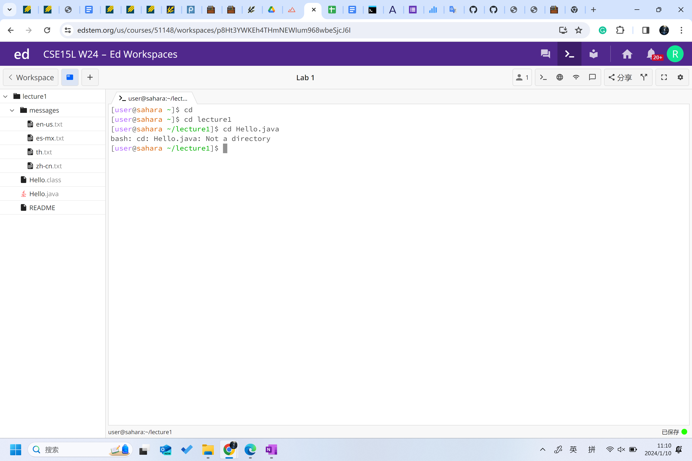
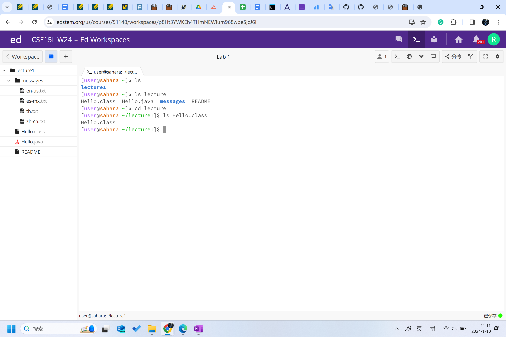
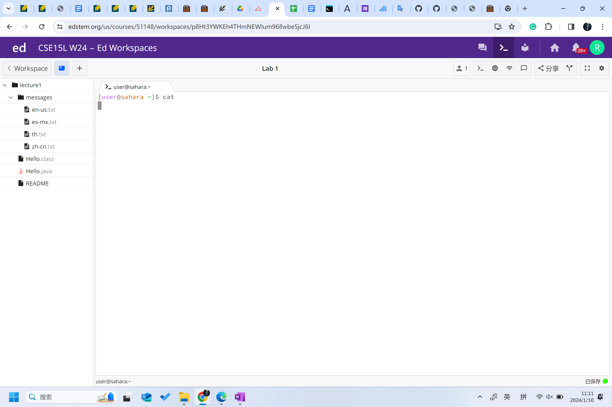
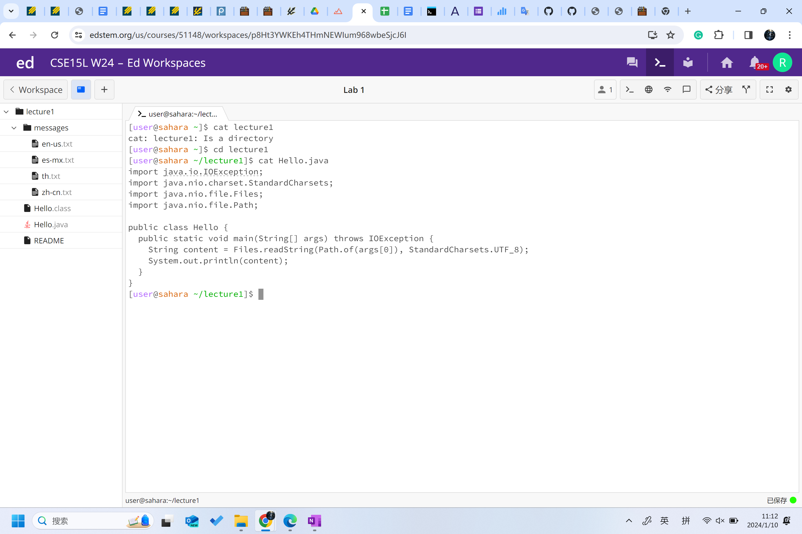

# Lab Report 1
## cd

### with no arguments

### with *directory* as arguments

### with *file* as arguments

## ls

### with no arguments

### with *directory* as arguments

### with *file* as arguments

## cat

### with no arguments

### with *directory* as arguments

### with *file* as arguments
